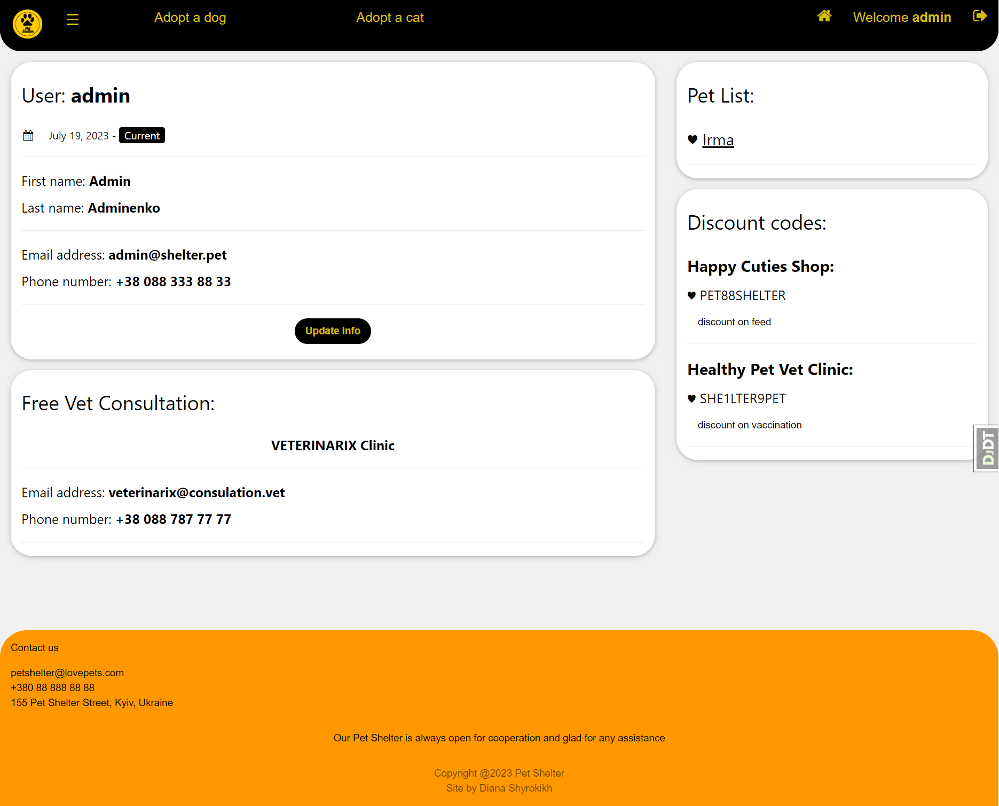

<div align="center">

# Pet Shelter Website 
 

</div>

<br>

> Let's give a shelter pet a second chance to find a family!

<hr>

## Table of Contents

- [About Project](#about-project)
- [Check it out](#check-it-out)
- [Application functional](#functional)
- [Technologies](#technologies)
- [Prerequisites](#prerequisites)
- [Setup](#setup)
- [Accessing the Application](#accessing-the-application)
- [Shutdown](#shutdown)
- [Demo](#demo)


<hr>

## About Project

Unfortunately, not every cat and dog has a loving family. Some of them even lost that.
<br>
It is also an important mission to give them back the happiness and faith in goodness that they deserve.
<br>
Whereas shelter volunteers and staff work with a large number of pets, they also need help structuring a large amount of information to make it easier to find new families for pets.

The Pet Shelter Site helps staff save data and help a potential new pet owner choose a pet.

<br>
The main functions of the project:

- Help people who want to find a pet by choosing it on the website;
- Manage all pet information;
-  Save information about pet owners to keep in touch with them;
- Allow users to get information about their pets, discounts and free vet consultations.

<hr>

## Check it out!

[Pet Shelter Site deployed to Render](https://pet-shelter-mwob.onrender.com)

<hr>

## Functional

1. Create staff profiles in admin page (superuser required)
2. Register a new user account and pet account (staff required)
3. Add a new cat and dog breed (staff required)
4. Change the user's email and phone number
5. Change all pet information (staff required)
6. Search cat or dog who needs family in the list by name and breed
7. Search pet in the pet list with all the info about the pet even who founded a family (staff required)
8. Search users by username, first name and last name (staff required)
9. Look for extra pet information in the pet profile
10. Look for users and their pets' information and discounts in the user profile


<hr>

## Technologies

- [Django Official Documentation](https://docs.djangoproject.com/)
<br>Django is a high-level Python Web framework. In this project, it's used to create the backend service. This service builds the Django application and exposes it on port 8000.


- [Postgres Official Documentation](https://www.postgresql.org/docs/)
<br>Postgres is a powerful, open-source object-relational database system. In this project, it is used as the main data store.
<hr>

## Prerequisites

1. Make sure you have Python installed on your system. 
You can check the installation instructions [here for Python](https://www.python.org/downloads/).

<hr>

## Setup

1. Clone the project:
```
git clone https://github.com/diana-shyrokikh/pet-shelter-site.git
```
2. Navigate to the project directory:
```
cd pet-shelter-site
```
3.  Сreate venv and install requirements in it:
```
python -m venv venv
venv\Scripts\activate (on Windows)
source venv/bin/activate (on macOS)
pip install -r requirements.txt
```

4. Сreate your secret key in secret_key.txt


5. Run Django server:
```
python manage.py runserver
```

<hr>

## Accessing the Application

1. The Pet Shelter Website is accessible at `http://localhost:8000/`.
2. Django Admin Page is accessible at `http://localhost:8000/admin`.


Use these credentials to log in as a user
<br>(functionality for staff will be open):

    Login: user 
    Password: user123456

<hr>

## Shutdown

1. To stop running the server use CTRL-BREAK

<hr>

## Demo




<hr>

Remember to replace `localhost` with the relevant IP address if you're not accessing these from the same machine where the services are running.
